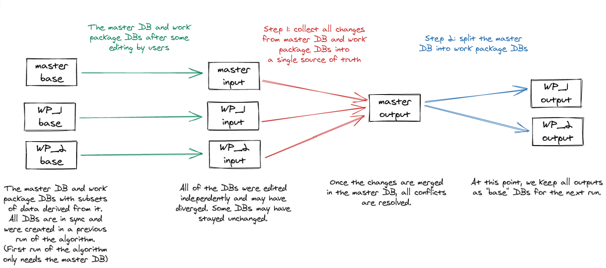

# mergin-work-packages

Mergin Work Packages - manage field surveys for multiple teams. 

The tool allows users to create Mergin projects that contain only a subset
of data of the main Mergin project and to set up two-way synchronization
between the main project and the dependent projects (called "work package projects"
in this context) as illustrated here:

 

The main project ("Survey") contains all data, while the work package projects
("Survey Team A", "Survey Team B") only contain partial data. Teams therefore
only can see and modify data assigned to them by the admin of the main project.

With the two-way synchronization provided by this tool:
- changes in the main project are propagated to the work package projects
- changes in the work package projects are propagated back to the main project

## Quick start

If you would like to start with a simple pre-configured project:

1. Clone [lutraconsulting/work-packages-demo](https://public.cloudmergin.com/projects/lutraconsulting/work-packages-demo/tree)
   Mergin project (you can do it either on the web or from the plugin). As the owner
   of the cloned project, you will have write permissions which are necessary to run the tool.
   Assuming your Mergin username is `john`, the cloned project could be called `john/test-work-packages`.
   
2. Download your cloned project and edit `mergin-work-packages.yml` configuration file.
   You will at least need to modify the `mergin_project` lines.
   You could use e.g. `john/farms-Kyle` and `john/farms-Emma` for project names of work packages.
   After your edits do not forget to sync your changes back to Mergin service.

3. Run the tool with the name of your project: 
   ```bash
   $ python3 wp_mergin.py john/test-work-packages
   ```
   After the initial run, you should see that the work package projects `john/farms-Kyle` and `john/farms-Emma`
   got created and they are ready to be used in QGIS or Input, containing subsets of data of the main project.

4. After you do modifications of the data in any of the projects (the main one or the work package projects)
   and run the tool again as in step 3, changes will be propagated among projects.

## How to use

We will assume that you have a Mergin project called `Survey` which contains the following files:
- survey.gpkg - a GeoPackage with a survey table called `farms`
- project.qgz - a QGIS project file using data from the GeoPackage

Data in the `farms` table can look like this:

| fid | name | geometry | notes | survey_team |
|-----|------|----------|-------|------|
|  1  | Old MacDonald's | POINT(...) | Lots of animals | A |
|  2  | MacGyver's farm | POINT(...) | Looking suspicious | B | 
| ... | ... | ... | ... | ... |

The `survey_team` column determines which team is responsible for the survey.

To configure the tool, we will create a YAML configuration file named `mergin-work-packages.yml`
and placed in the root folder of Mergin project. Here is how it can look like:

```yaml
file: survey.gpkg

tables:
  - name: farms
    method: filter-column
    filter-column-name: survey_team

work-packages:
  - name: TeamA
    value: A
    mergin-project: My Company/Survey Team A
  - name: TeamB
    value: B
    mergin-project: My Company/Survey Team B
```

Next to the path to the GeoPackage (`file`), there are the following bits of configuration:

- `tables` list - defines which tables will be filtered and based on which column.
  Each item has to define name of the filtered table (`name`) and filtering method
  (`method`). Currently `filter-column` is the only supported method, where values
  from the given column are used to determine whether the row belongs to a particular
  work package or not - this is set with `filter-column-name`.

- `work-packages` list - defines dependent "work package" projects:
  what is the internally used name of each work package (`name`), what is the expected
  value of the filter column (`value`) and which Mergin project is assigned to that
  work package (`mergin-project`). 

After the configuration file is written (and synced to the Mergin project), we are all
set to run the tool. We only need to specify name of the main Mergin project, the tool
will ask about the login credentials to Mergin and run the processing:  

```bash
$ python3 wp_mergin.py "My Company/Survey"
```

After the initial run of the tool, the `Survey Team A` and `Survey Team B` Mergin projects will be created,
containing the filtered GeoPackage and any other files from the original (main) project, in our case just the
`project.qgz` file.

The main project and the work package projects can be shared with others and updated, they are independent. But next time
you run the tool, it will do the two-way sync: pull changes from projects for teams A and B, merge
them with changes in the main project, and finally update data in all connected Mergin projects.

## Under the hood

The following figure illustrates how the merge/split algorithm works in two steps to first merge changes
in the main (master) project with changes in the work package projects, followed by update of the work
package projects to a new state based on the merged content of the main (master) project. 

 

The "base" data are stored in `mergin-work-packages` sub-directory of the main Mergin project
from previous runs of the tool (and should never be edited by users). The "input" data are
the latest versions of the user data in the main (master) project and in work package projects.
The "output" data are then pushed to the main (master) project and work package projects,
and also kept as the "base" data for the next run of the tool.

## Run tests 

### MacOS
```
/Applications/QGIS3.16.app/Contents/MacOS/bin/python3 -m pip install pytest
MERGIN_WORKPACKAGES_TMP=~/tmp/mergin_wp /Applications/QGIS3.16.app/Contents/MacOS/bin/python3 -m pytest -v
```

## Developing on Windows
If you're experiencing sqlite3 DLL issues after installing tool dependencies make sure that you have path with `sqlite3.dll` library added to the system PATH 
environment variables list. For OSGeo4W users you can use `C:\OSGeo4W64\bin`.
